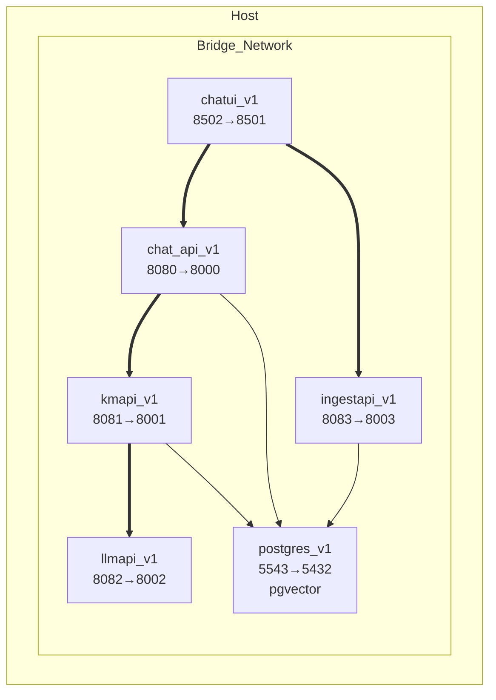
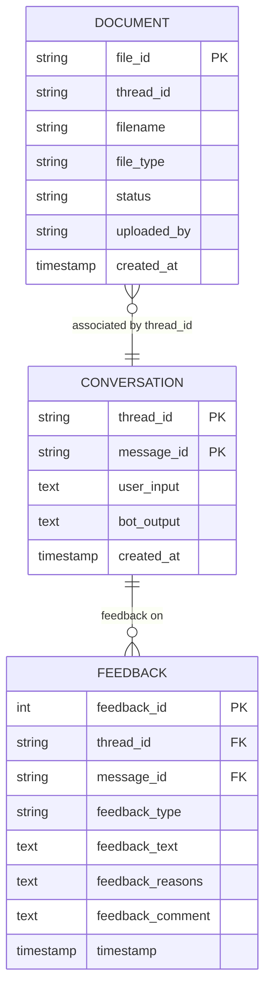
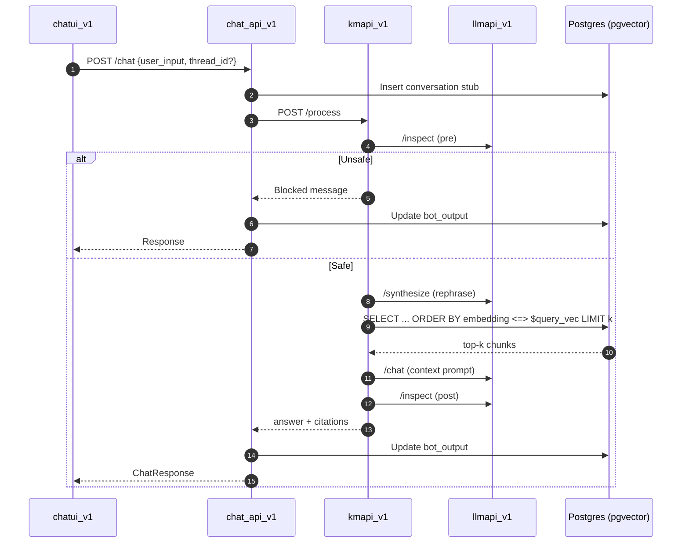
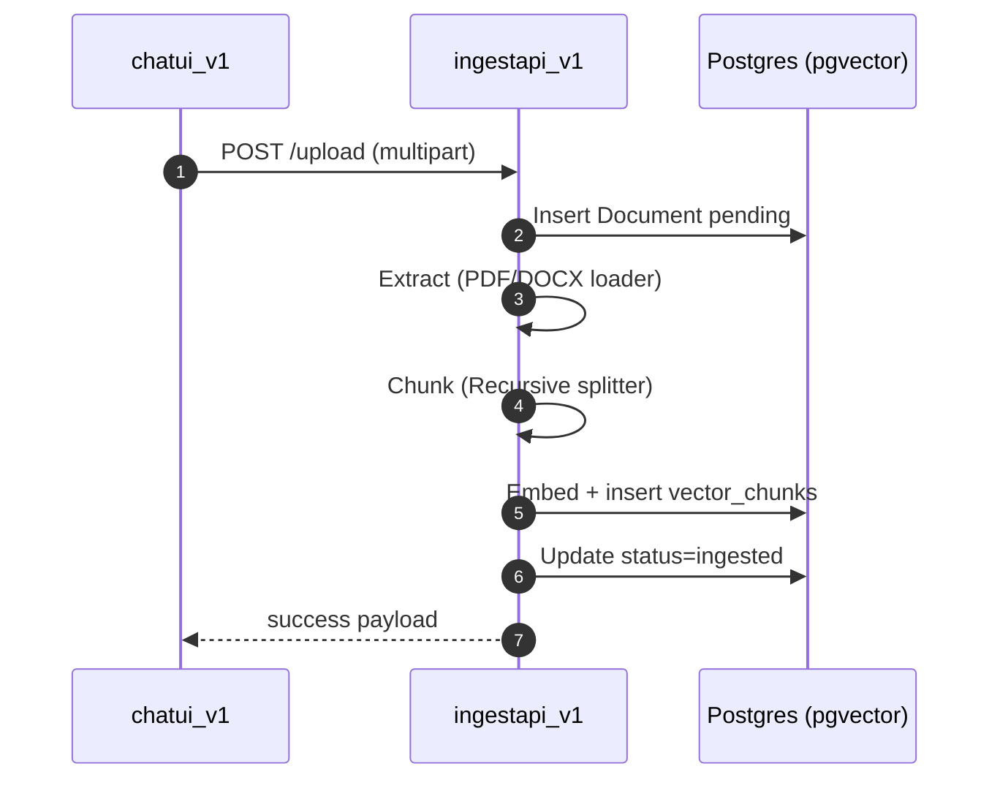
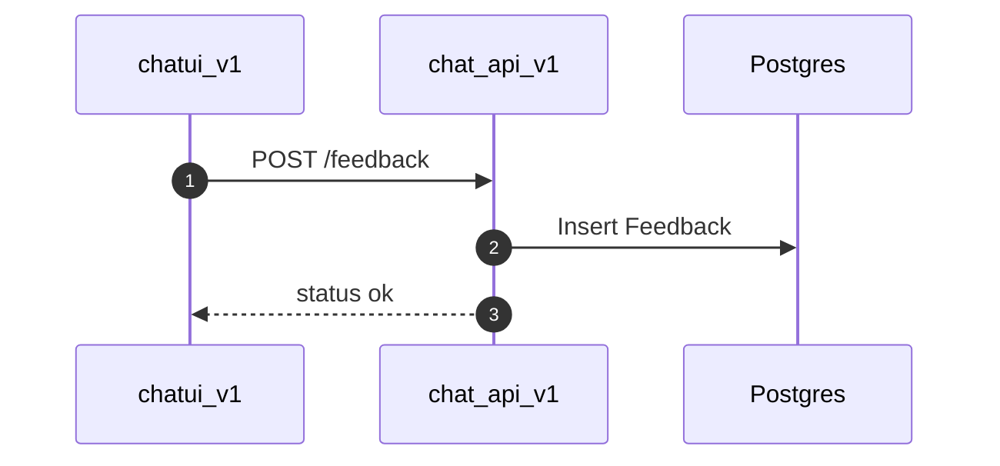

# Architecture Overview


## 1. Service Topology

```mermaid
flowchart LR
    UI[chatui_v1\n(Streamlit)] -->|/chat, /feedback| CHAT[chat_api_v1]
    UI -->|/upload| INGEST[ingestapi_v1]

    CHAT -->|/process| KM[kmapi_v1]
    KM -->|/inspect, /synthesize, /chat, /embed| LLM[llmapi_v1]

    %% Vector storage now in Postgres (pgvector)
    INGEST -->|insert chunks| PG[(postgres_v1\n+ pgvector)]
    KM -->|similarity <=>| PG
    CHAT -->|SQL| PG

    subgraph Persistence
        PG
    end
```

## 2. Deployment (Docker Compose)



## 3. Domain Model (ER)



## 4. End-to-End Flows

### 4.1 Chat (RAG Pipeline)


### 4.2 File Upload & Ingestion


### 4.3 Feedback


## 5. Service Responsibilities

| Service | Responsibility | Key Endpoints |
|---------|---------------|---------------|
| chatui_v1 | UX: upload, chat, feedback, local state management | (frontend only) |
| ingestapi_v1 | File ingestion, parsing, chunking, embedding, vector persistence | /upload, /ingest, /index_stats |
| kmapi_v1 | RAG orchestration: safety → rephrase → retrieve → synthesize → post-check | /process, /reload_index |
| llmapi_v1 | Abstraction over OpenAI (embeddings + chat + simple moderation) | /inspect, /embed, /synthesize, /chat |
| chat_api_v1 | Conversation persistence, feedback handling, delegating answer generation | /chat, /feedback |
| postgres_v1 | Relational persistence | n/a |
| Postgres pgvector | Vector similarity store (embedding + metadata) | n/a |

## 6. Configuration & Environment

Common env variables:
- `OPENAI_API_KEY`
- `DATABASE_URL`
<!-- Removed legacy FAISS path var -->
- `KM_API_URL`, `LLM_API_URL`, `CHATBOT_API_URL`, `INGESTION_API_URL`

`environment.env()` helper enforces required vars and supports defaults.

## 7. Error Handling & Resilience
- Network calls wrapped in try/except with specific `requests` exceptions (timeout, connection, HTTP error).
- Fallback messages returned to user instead of propagating stack traces.
- Safety checks before and after generation (keyword-based now; easily replaceable).
- Vector retrieval via pgvector `<=>` cosine distance (no external index service).

## 8. Performance Notes
- Retrieval step logs timings (embedding, similarity, total) for profiling.
- Ingestion synchronous; large files block request. Consider async queue (Celery / RQ) for scale.
- LLM calls serialized per request; concurrency scaling occurs at process level (multiple replicas) + OpenAI backend.

## 9. Observability Gaps / Improvements
| Area | Current | Suggested |
|------|---------|----------|
| Tracing | None | OpenTelemetry spans across services |
| Metrics | Log-only | Prometheus counters (requests, latency buckets) |
| Structured Logs | Free-form | JSON logs + correlation_id |
| Health | Basic /health | /ready (DB + index) /live separation |

## 10. Security Considerations
- No auth: add API keys or OAuth2 (even simple shared token) for non-public deployments.
- Rate limiting missing (reverse proxy or gateway recommended).
- Sanitization minimal—rely on upgraded moderation & allow-list file types.
- Secrets: ensure `.env` not committed; rotate `OPENAI_API_KEY` regularly.

## 11. Scalability Roadmap
| Phase | Goal | Actions |
|-------|------|---------|
| 1 | Better stability | Add reload on ingestion completion; structured logs; request IDs |
| 2 | Horizontal scale | Separate vector store service; replicate APIs with load balancer |
| 3 | Multi-tenant | Namespace thread_id; per-tenant schema / row‑level filters |
| 4 | Advanced RAG | Reranking layer, hybrid BM25+vector search, conversation memory inclusion |

## 12. Known Limitations
- Rephrasing expects strict JSON; brittle to LLM drift.
- Index not auto-reloaded by KM after ingestion unless service restarts or /reload_index called manually.
- Duplicate document ingestion not prevented (no content hash check yet).
- Simple keyword safety may allow adversarial prompts.

## 13. Enhancement Backlog (Actionable)
1. Add ingestion → KM webhook or direct call to `/reload_index`.
2. Introduce file hash dedupe in ingestion (store hash in Document table).
3. Implement conversation window (last N user/bot turns) to improve context.
4. Replace keyword safety with OpenAI Moderation or Guardrails style policy.
5. Add `/metrics` endpoints (Prometheus) for each API.
6. Centralize embedding calls in llmapi_v1 for ingestion (already centralized for KM queries).
7. Add retention / deletion endpoint for user documents & associated vectors.
8. Provide bulk export (JSON) for conversation + feedback analytics.

## 14. Testing Strategy Suggestions
- Unit: isolate FAISSWriter, rephrase parsing fallback, safety filter.
- Integration: mocked llmapi_v1 for deterministic RAG responses.
- Contract tests: schema validation of /chat, /process, /upload responses.
- Performance: load test /process with Locust (simulate embedding + retrieval latency).

## 15. Operational Runbook (Excerpt)
| Task | Command |
|------|---------|
| Rebuild changed service | `docker compose up -d --build <service>` |
| View logs (kmapi) | `docker compose logs -f kmapi_v1` |
| Reload KM index | `curl -X POST http://localhost:8081/reload_index` |
| Check ingestion stats | `curl http://localhost:8083/index_stats` |
| Health checks | `curl http://localhost:8080/health` etc. |

## 16. Sequence Summary (Condensed ASCII)
```
User -> chatui_v1 -> chat_api_v1 -> kmapi_v1 -> (llmapi_v1 + Postgres pgvector) -> chat_api_v1 -> chatui_v1
User -> chatui_v1 -> ingestapi_v1 -> (Postgres pgvector)
```

## 17. Glossary
- Thread: Logical conversation grouping for user messages & responses.
- Message: Single user or bot exchange identified by message_id.
- Chunk: A split segment of document text embedded individually.
- Citation: Metadata object returned with answer referencing source chunk.

---
Feel free to request a lighter executive summary or deeper drill-down (e.g., just RAG tuning). Open to adding diagrams for scaling or HA patterns on request.

## 18. Prompt Architecture (_v1 Centralization)

### Goals
- Single source of truth for reusable system + user prompt templates.
- Reduce inline string duplication and drift across services.
- Allow future A/B testing or policy updates by editing JSON only.

### Directory
`prompts/`
- `rephrase_v1.json` – intent extraction & search query refinement.
- `rag_answer_v1.json` – grounded answer synthesis instructions.
- `safety_inspect_v1.json` – safety classification (pre & post generation).
- `prompt_loader.py` – utilities: `load_prompt(name)`, `format_prompt(name, **vars)` with LRU caching.

### JSON Schema (informal)
```
{
    id: string,             # logical identifier
    description: string,    # human readable purpose
    system: string,         # system role content (optional)
    user_template: string,  # contains {placeholders}
    ...additional metadata
}
```

### Runtime Usage
`kmapi_v1`:
1. Rephrase step loads `rephrase_v1` with `{question}` → sends via `/synthesize` for structured JSON (`{"intent":..., "rephrased":...}`).
2. Answer synthesis loads `rag_answer_v1` with `{context}`, `{user_query}` → constructs final `/chat` prompt.

`llmapi_v1`:
1. Safety `/inspect` endpoint loads `safety_inspect_v1` with `{text}` and attempts model-based JSON classification.
2. Falls back to lightweight keyword heuristic if JSON invalid or template missing.

### Substitution & Validation
- `format_prompt` performs naive `str.format`; missing placeholders raise `KeyError` (caught and fallback applied).
- Safety inspect: Attempts strict `json.loads` then regex JSON extraction fallback.
- Rephrase: If JSON parse fails, may still accept short plain-text output as rephrased query (len < 160 chars).

### Fallback Hierarchy
1. Template load / substitution success → use model output.
2. Template load failure → inline legacy prompt string.
3. Model output invalid JSON → partial heuristics or original query.
4. Safety classification failure → keyword heuristic.

### Future Extensions
- Add `version` field and implement semantic version negotiation.
- Introduce `output_schema` field to drive automatic JSON schema validation.
- Add localized variants (`*_v1.en.json`, `*_v1.es.json`).
- Implement telemetry: log template id + hash for reproducibility.
- Hot-reload mechanism (invalidate LRU cache when file mtime changes).

### Risks & Mitigations
| Risk | Impact | Mitigation |
|------|--------|-----------|
| Template JSON malformed | Runtime KeyError / parse fail | Pre-commit JSON lint, startup validation hook |
| Missing placeholder | User prompt falls back reducing retrieval quality | Add unit tests for `format_prompt` coverage |
| Model deviates from strict JSON | Downstream parse errors | Add structured output enforcement / JSON repair model |
| Silent template drift | Inconsistent experiments | Add checksum logging & config-driven template selection |

---
